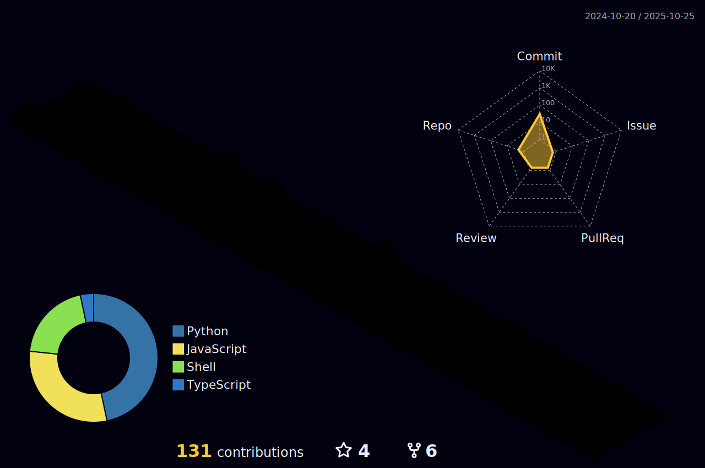

<h1 align="center">
  
</h1>

<h3 align="center">A Developer who writes code like it's poetry, except my poems occasionally crash and need debugging. Problem-solving is a brain-draining rollercoaster that occasionally makes me want to throw my keyboard out the window, but the thrill of cracking the puzzle and seeing everything click into place? That's pure satisfaction. Let's build something great together, one bug at a time!</h3>

<h3 align="left">🌐 Connect with me:</h3>

## My Profile

| **Experience**                                                                                   | **Education**                                             | **Volunteer/Opensource Contribution**                                 | **Achievements**                                                                                                                                                                                                                  |
|--------------------------------------------------------------------------------------------------|-----------------------------------------------------------|----------------------------------------------------------------------|---------------------------------------------------------------------------------------------------------------------------------------------------------------------------------------------------------------------------------|
| **SWE Intern**   Infosys - Remote Mumbai INDIA  Apr 2024 - Jun 2024   - Developed an interactive map feature   - Implemented Hashing and Encryption   - Resolved timeslot conflicts     **Full Stack Intern**   Persist Ventures -Remote Los Angeles, California, USA   Jul 2023 - Oct 2023   -Developed a Chrome extension leveraging ML that autonomously populate form fields from user-uploaded PDFs    **AI & ML Developer**   TCET Open Source -Hybrid Mumbai, INDIA  2023 - Present   - Maintainer of Resume Screener Project   - Assign issues, discuss ideas for upcoming projects   - resolve developer queries and maintain the Project Repository. | **Bachelor’s Technology** (Pursuing)   Thakur College of Engineering and Technology   2025   - CGPA: 9.94/10     **Higher Secondary Education**   Bhartiya Vidya Bhavans Institute of Science   2020   - JEE Mains: 90.89%   - MHTCET: 95.19%    **High School**   St. John The Evangelist High School   2018   - School Rank: 2   - 93%        | **President**   Mind Benders Club   2019 - Present   - Organized club activities   - Led initiatives to foster innovation    **Social Summer of Code 24 Contributor**   --**CopilotKit** Integrated copilotkit for better user experience   --**Shepherd.Js** Integrated shepherd.js for better user Walkthrough   --**LLMWare** Used llmware model for chatbot widget    **Editorial Board Core**   Byte Magazine   2019 - Present   - Managed content   - Coordinated with writers            | ❖ Hackspiraton’24 Hackathon Solidity Scan Track Bounty winner   ❖ Solving for India Hack Regional Qualifier powered by Google & AMD    ❖ Global Rank 677 @ LeetCode Biweekly contest-132   ❖ All INDIA Rank 135 : Coding Ninjas Code Combat 3.0   ❖ Nexathon 4.0 Hackathon Winner   ❖ Rank 1 @ HackerRank SSC-3                    |

## SKILLS

| Languages          | Databases            | DevOps       | Frameworks              | Tools                       | Others                      |  
|--------------------|----------------------|--------------|-------------------------|-----------------------------|-----------------------------|
| C/C++              | SQLite               | CI/CD        | Spring Boot             | Git                         | Computer Networks           |
| Java               | PostgreSQL           | Docker       | NodeJS                  | Linux                       | Operating Systems           |
| Python             | MongoDB              | Jenkins      | ReactJS                 | Docker                      | System Design               |
| TypeScript         | Firebase             |              | Express.js              | GCP                         | Microservices               |
| Solidity           |                      |              | Django                  | AWS                         | Cloud Computing             |
| Rust               |                      |              | Flask                   | Cisco Packet Tracer         |                             |
|                    |                      |              |                         | GitHub                      |                             |
|                    |                      |              |                         | Soroban SDK, Stellar        |                             |
|                    |                      |              |                         | MetaMask, Freighter Wallet  |                             |
## 💫 Github Stats

<h3 align="center">Statistics</h3>

<a href="https://github.com/ai-apex-dev">

 

<h4 align="left">My Hactoberfest 2022 & 2023 Badges:</h4>

<!--
# 📊 LeetCode Stats

 

-->
# ✍️ Dev Quote

## 💰 If you like my work ->
   

